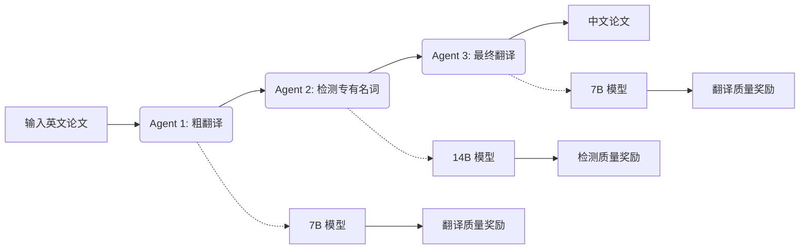
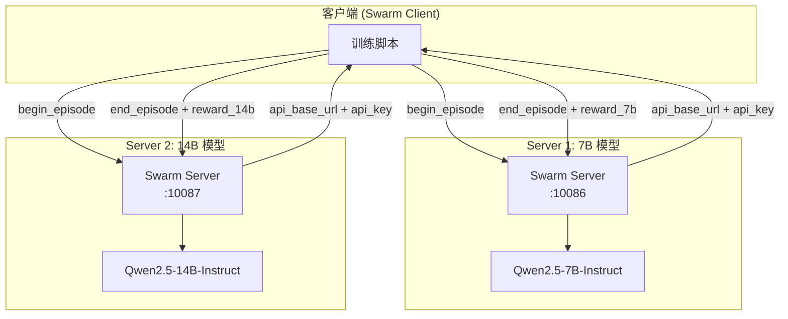
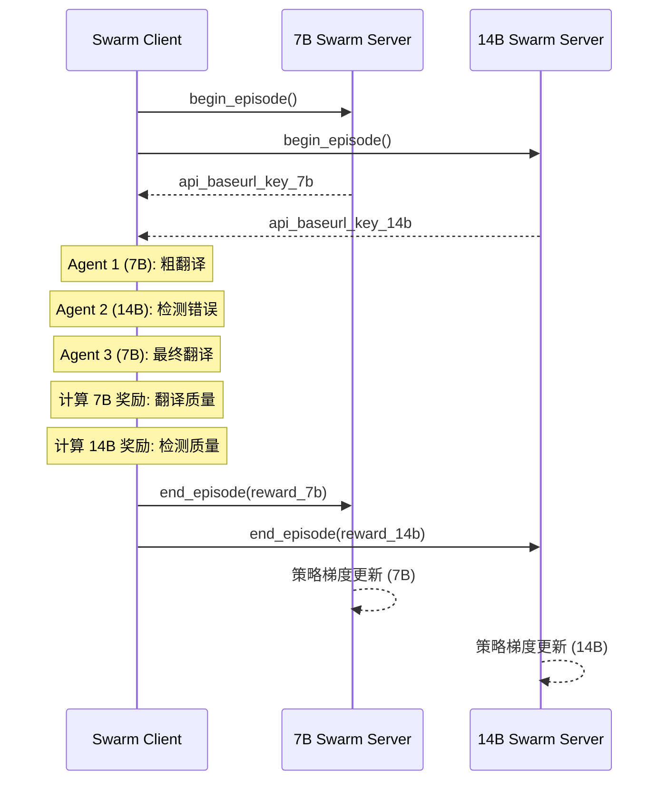

# 非共享参数多智能体强化学习实战

在传统的多智能体强化学习（MARL）系统中，所有智能体通常共享同一套模型参数——这意味着无论有多少个智能体，它们都共用一个"大脑"。这种设计虽然简单，但在实际应用中存在明显的局限性：不同智能体可能需要不同规模的模型来执行不同复杂度的任务。AgentJet 的 Swarm 训练模式突破了这一限制，实现了真正的**非共享参数多智能体强化学习**。

## 背景：从"共享大脑"到"异构团队"

在传统框架中训练多智能体系统时，研究者面临一个隐含假设：所有智能体必须共享同一个底层模型。这种设计源于大多数训练后端（如 VERL 和 TRL）的架构限制——它们通常只支持对单个 LLM 模型进行微调训练。

然而，这种"共享大脑"的设计在很多场景下并不经济：

- **能力错配**：一个负责高层规划的 Agent 可能需要 32B 的大模型来保证推理质量，而负责具体执行的 Agent 用一个 7B 的小模型就足够了
- **资源浪费**：用大模型处理简单任务是对计算资源的浪费
- **训练信号单一**：所有智能体接受相同的奖励信号，难以针对各自的任务进行专门优化

AgentJet Swarm 模式通过部署多个独立的 Swarm Server，每个 Server 承载不同大小的模型，实现了真正的**异构多模型训练**。每个模型可以拥有独立的训练配置、奖励函数和优化目标。

## 示例场景：学术论文翻译工作流

让我们通过一个具体的例子来理解非共享参数多智能体强化学习的工作方式。本示例实现了一个三阶段的学术论文翻译工作流：



在这个工作流中：

- **Agent 1（粗翻译）**：使用 7B 模型将英文论文初步翻译为中文
- **Agent 2（检测专有名词）**：使用 14B 模型检测翻译中的专有名词错误（如术语翻译、缩写处理等）
- **Agent 3（最终翻译）**：使用 7B 模型根据检测结果生成最终的中文翻译

## 核心创新：独立奖励函数

传统方案中，所有智能体共享同一个奖励信号——无论哪个 Agent 产生输出，奖励都基于最终翻译质量来计算。这种设计存在一个根本问题：Agent 2（14B 模型）实际上是在为"最终翻译质量"而不是"检测质量"负责，这导致训练信号模糊，模型难以学到真正的检测能力。

本示例的创新之处在于为每个模型配置了**独立的奖励函数**：

| 模型 | Agent 角色 | 奖励函数 | 评估重点 |
|------|-----------|---------|---------|
| 7B | Agent 1 & 3 | TranslationQualityGrader | 最终翻译质量（人称代词、缩写、语序、主语清晰度） |
| 14B | Agent 2 | ProperNounDetectionGrader | 专有名词检测质量（完整性、准确性、误报率） |

这种设计的优势在于：

1. **任务特异性训练**：每个模型学习其特定角色的最佳策略
2. **信号清晰**：14B 模型直接学习"如何检测错误"，而非"如何让最终翻译看起来更好"
3. **资源优化**：简单翻译任务使用小模型，复杂检测任务使用大模型
4. **独立演化**：7B 和 14B 模型可以独立优化，互不干扰

## 系统架构

AgentJet 通过部署**两个独立的 Swarm Server** 来实现非共享参数训练：



**架构说明**：

- **Swarm Server 1 (端口 10086)**：承载 7B 模型，负责 Agent 1 和 Agent 3 的推理与训练
- **Swarm Server 2 (端口 10087)**：承载 14B 模型，负责 Agent 2 的推理与训练
- **Swarm Client**：运行在任何设备上，负责工作流编排和奖励计算

客户端代码只需要传入两个不同的 `api_baseurl_key`，分别对应两个模型：

```python
def rollout(task):
    # 从两个 Swarm Server 获取独立的 API 凭证
    episode_uuid_7b, api_baseurl_key_7b = swarm_worker_7b.begin_episode()
    episode_uuid_14b, api_baseurl_key_14b = swarm_worker_14b.begin_episode()

    # 使用两个模型执行工作流
    workflow_output_7b, workflow_output_14b = execute_agent(
        task,
        api_baseurl_key_7b,
        api_baseurl_key_14b
    )

    # 分别向两个 Server 报告各自对应的奖励
    swarm_worker_7b.end_episode(task, episode_uuid_7b, workflow_output_7b)
    swarm_worker_14b.end_episode(task, episode_uuid_14b, workflow_output_14b)
```

## 奖励函数设计

### 7B 模型奖励：翻译质量评估

7B 模型（Agent 1 和 Agent 3）的奖励由 `TranslationQualityGrader` 计算，评估标准包括：

- **第一人称代词使用**：禁止使用"我们"，应使用"本研究"、"本文"等
- **缩写翻译**：当有简洁中文表达时使用缩写（如 GWs 而非"引力波"）
- **语序调整**：未按中文习惯调整句子结构
- **主语清晰度**：主语缺失或不明确
- **专有名词翻译**：领域术语翻译错误

评分范围 0-2 分，归一化到 [0, 1]。

### 14B 模型奖励：检测质量评估

14B 模型（Agent 2）的奖励由 `ProperNounDetectionGrader` 计算，评估标准包括：

- **完整性**：是否检测到所有关键错误（第一人称代词、缩写问题、专有名词错误等）
- **准确性**：检测到的错误是否准确，纠正建议是否合理
- **误报率**：是否将正确的翻译标记为错误
- **JSON 格式**：输出是否为有效的 JSON 格式

同样采用 0-2 分的评分体系，归一化到 [0, 1]。

## 训练流程

整个训练流程如下：



每个训练周期中：

1. 客户端同时向两个 Swarm Server 请求 episode 资源
2. 执行完整的工作流，获取两个模型的输出
3. 分别计算两个奖励：7B 基于最终翻译质量，14B 基于检测质量
4. 将各自的奖励汇报给对应的 Swarm Server
5. 两个 Server 独立执行策略梯度更新

## 训练曲线


## 优势总结

与传统的单模型共享参数训练相比，非共享参数多智能体强化学习具有显著优势：

| 特性 | 共享参数 | 非共享参数（本示例） |
|------|---------|-------------------|
| 模型配置 | 单一模型 | 7B + 14B 异构组合 |
| 奖励信号 | 统一奖励 | 任务特异性奖励 |
| 资源利用 | 低效（大模型处理简单任务） | 高效（按需分配） |
| 训练目标 | 所有 Agent 优化同一目标 | 每个 Agent 优化各自目标 |
| 扩展性 | 受限于单一模型容量 | 可独立扩展各组件 |

## 延伸阅读

### 交叉引用

- **[AgentJet Swarm 训练模式](../swarm.md)**：深入了解 AgentJet 蜂群架构的设计理念和核心优势
- **[可训练工作流](../workflow.md)**：学习如何在 AgentJet 中定义多智能体工作流
- **[任务评判器](../task_judger.md)**：了解奖励函数的设计原理和自定义方法
- **[数学 Agent 示例](../example_math_agent.md)**：学习单智能体训练的基础示例

### 接下来推荐阅读

1. **[Werewolves 狼人杀游戏](../example_werewolves.md)**：了解如何在 AgentJet 中训练多智能体协作与竞争
2. **[学术翻译蜂群训练](../example_academic_trans_swarm/README.md)**：了解更简单的单模型版本实现
3. **[蜂群训练博客](swarm_intro_blog_zh.md)**：深入理解非共享参数训练的更多应用场景
