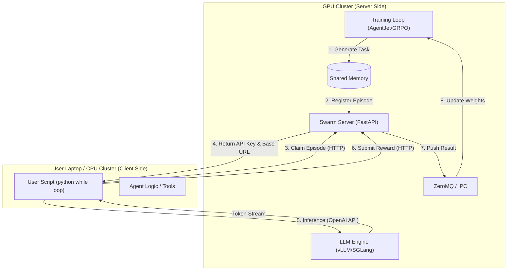
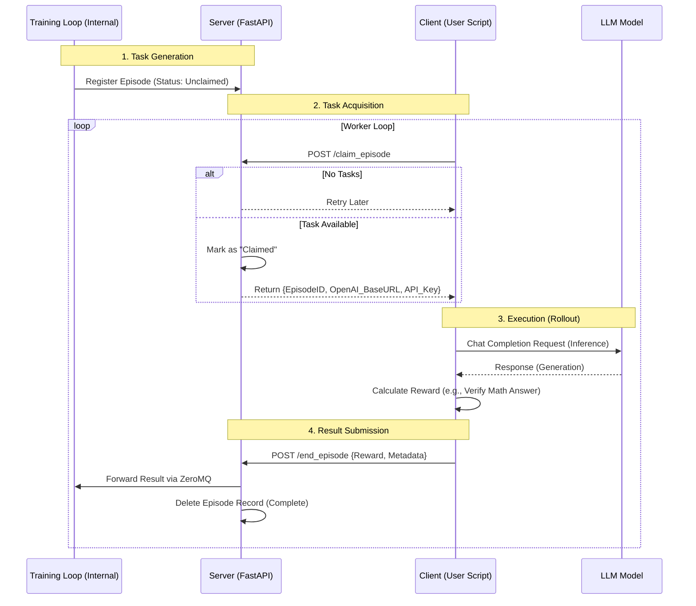
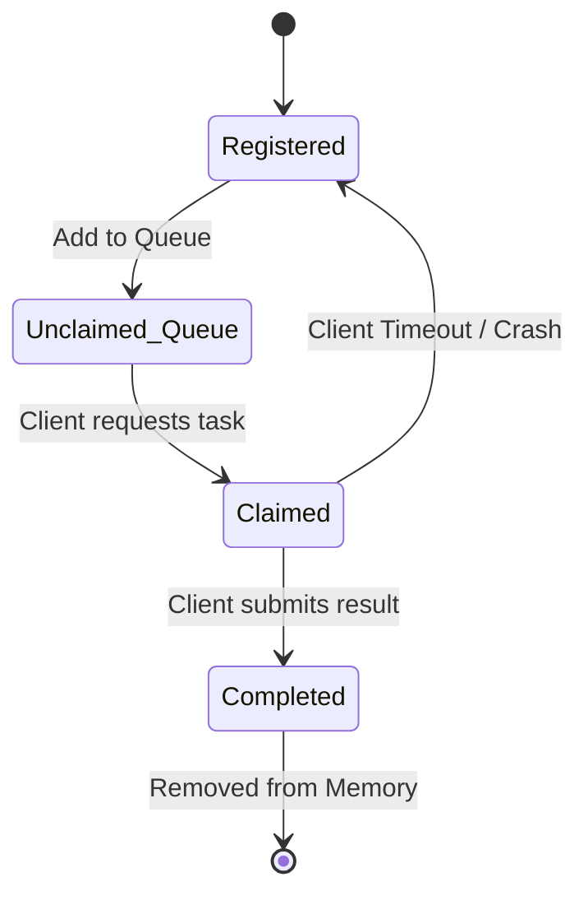

# Swarm Design Blueprint / Swarm 设计蓝图

[English](#english-version) | [中文](#chinese-version)

---

<a id="english-version"></a>
## 🇬🇧 English Version

### 1. Overview
**Swarm** is an experimental component of AgentJet designed to decouple the **Training Logic** from the **Agent Execution Logic**. It allows users to train **full-weight LLM models** on machines without GPUs (e.g., a laptop) by offloading the actual model computation to a remote GPU server.

Unlike traditional setups where the user code must run inside the training cluster, Swarm allows you to verify and run your agent logic locally while the heavy lifting (training & inference) happens remotely.


>
> Relationship between **Swarm** and **Tinker**:
>
> **No relationship at all** (just like **JavaScript** and **Java**). **Swarm** is open-source and free. **Tinker** is close-source and not free.


## Tinker 与 AgentJet-Swarm 对比表

| 特征 | Tinker | AgentJet-Swarm |
|------|--------|--------------|
| **开源性质** | ❌ 闭源 | **✅ 开源免费** |
| **收费模式** | 付费服务 | **✅ 完全免费** |
| **目标用户** | 研究人员和开发者 | 研究人员和开发者 |
| **任务** | 各种 LLM 训练 | 专精 LLM Agent RL训练 |
| **核心功能** | LLM 微调训练 API | **✅ LLM 微调训练整套解决方案** |
| **架构模式** | 托管服务 + 单点客户端 API | **✅ 服务器和客户端都可按需拓展** |
| **多客户端共同参与训练** | ❌ 不支持 | **✅ 支持** |
| **远程算力部署方式** | Thinking Machines Lab 公司提供定价 | **✅ 自建 GPU 服务器端 或 使用阿里云灵骏** |
| **训练方式** | ❌ LoRA 微调 | **✅ 全量 LLM 模型训练** |
| **支持的模型** | ❌ 少部分 LLM 模型 | **✅ 大多数新旧 LLM 模型** |
| **最大模型规模** | Llama 70B、Qwen 235B | **✅ 取决于用户 GPU 集群配置** |
| **通信协议** | 专有 API | **✅ 专有API + OpenAI兼容API** |
| **推理引擎后端** | 内置未知推理服务 | **✅ vLLM/SGLang任选** |


### 2. Core Architecture

The system involves two main parties: the **Swarm Server** (running on the GPU cluster) and the **Swarm Client** (running on your local machine).



### 3. Detailed Workflow

The workflow relies on a "Claim & Submit" model. The training loop generates tasks ("Episodes") and waits for external workers to pick them up.



### 4. Episode State Machine

To handle network failures or client crashes, the server maintains a state machine for every episode.



*   **Registered**: Task created by the training algorithm.
*   **Claimed**: A client is currently working on it.
*   **Timeout**: If a client claims a task but doesn't report back within `discard_episode_timeout`, the server reverts the status to **Registered** so another client can try.

### 5. Implementation Example

The user experience is designed to be minimal. You simply query the remote server for a "job", do the work, and report the "score".

```python
# User-side Code Concept
def rollout(task):
    # 1. Handshake & Claim (Get credentials for this specific episode)
    api_baseurl_key = tinkerjet_remote.begin_episode()

    # 2. Run your existing agent logic using standard OpenAI format
    workflow_output = execute_agent(task, api_baseurl_key)

    # 3. Submit results
    tinkerjet_remote.end_episode(workflow_output)
    return workflow_output.reward
```


<div align="center">
  <a href="https://modelscope.github.io/AgentJet" target="_blank">
    
  </a>
</div>
